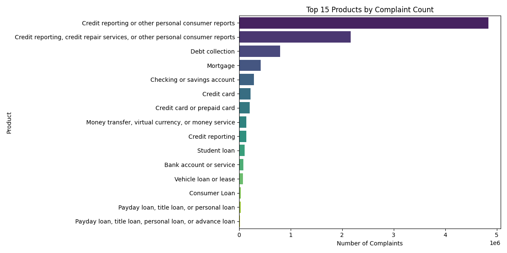
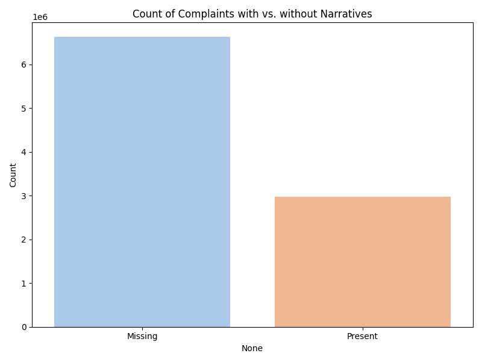
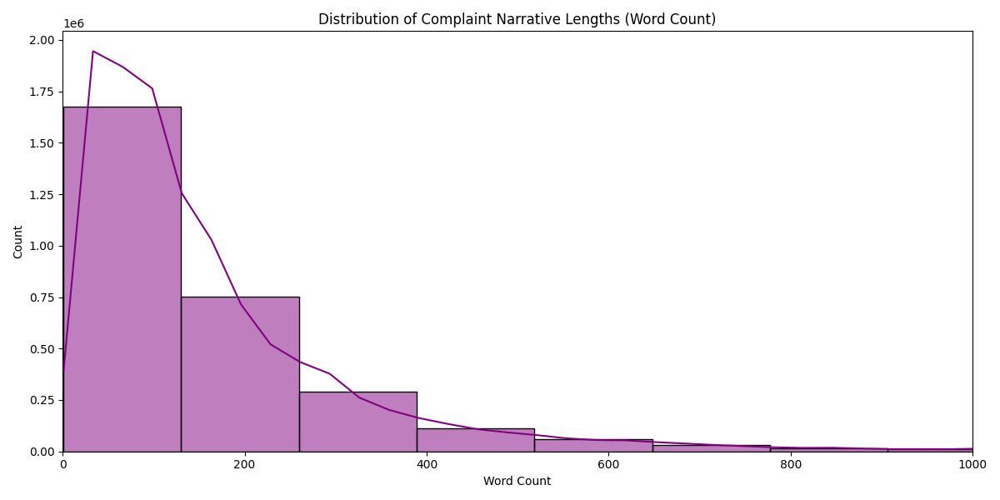

# Interim Report: Intelligent Complaint Analysis

## 1. Introduction
The Consumer Financial Protection Bureau (CFPB) receives thousands of consumer complaints daily regarding financial products and services. Effectively analyzing these complaints is crucial for identifying systemic issues, ensuring regulatory compliance, and improving customer outcomes. However, the sheer volume of unstructured narrative data makes manual analysis impractical.

This project aims to build a Retrieval-Augmented Generation (RAG) system to intelligently query and analyze this complaint data. This interim report covers the first two phases:
1.  **Task 1: Exploratory Data Analysis (EDA) & Preprocessing**: Understanding the dataset, cleaning it, and preparing it for NLP tasks.
2.  **Task 2: Text Chunking, Embedding & Vector Store**: Transforming the unstructured text into vector embeddings and storing them in a database for efficient retrieval.

## 2. Task 1: Exploratory Data Analysis & Preprocessing

### 2.1 Dataset Overview
-   **Source**: Consumer Financial Protection Bureau (CFPB) Complaints Dataset.
-   **Original Dataset Size**: 9,609,797 records.
-   **Filtered Dataset Size**: 2,980,756 records.

The raw dataset contains complaints across various financial products. A significant portion of records lacked the "Consumer complaint narrative" field, which is the core component for our RAG system.

### 2.2 Product Distribution Analysis
The dataset covers a wide range of financial products. "Credit reporting" and "Debt collection" are consistently the top categories.

*Figure 1: Top 15 Products by Complaint Count. This distribution highlights the dominance of credit reporting issues.*

### 2.3 Complaint Narrative Analysis
A critical finding during EDA was the missingness of narrative text. Only approximately 31% of the original records contained a consumer narrative.

*Figure 2: Count of Complaints with vs. without Narratives. We filtered the dataset to include only the ~3 million records with narratives.*

The length of these narratives varies significantly, with a distribution skewed towards shorter, concise complaints, though some are quite extensive.

*Figure 3: Distribution of Complaint Narrative Lengths (Word Count). Most complaints are under 200 words, but the chunking strategy accommodates longer texts.*

### 2.4 Data Cleaning & Filtering Decisions
To ensure high-quality retrieval, the following preprocessing steps were applied:
1.  **Narrative Filtering**: We dropped all rows where `Consumer complaint narrative` was null. Embeddings cannot be generated from empty text.
2.  **Product Retention**: We retained the full diversity of products but stratified sampling in Task 2 ensures we don't over-represent just the top categories in the vector store.
3.  **Result**: A clean dataset of ~2.98 million records saved to `data/filtered_complaints.csv`.

## 3. Task 2: Text Chunking, Embedding & Vector Store

### 3.1 Sampling Strategy
Due to the large size of the filtered dataset (2.98M rows) and computational constraints for embedding, we applied **Stratified Sampling**.
-   **Sample Size**: 12,000 complaints.
-   **Method**: Stratified by `Product`. This ensures that minority categories (e.g., "Student loan", "Money transfers") are represented proportionally and not drowned out by the massive volume of "Credit reporting" complaints.

### 3.2 Text Chunking Strategy
Long narratives cannot be embedded as a single vector effectively due to model context limits.
-   **Chunk Size**: 500 characters.
-   **Overlap**: 50 characters.
-   **Justification**: A 500-character chunk size captures sufficient context for a semantic query without being too broad. The 50-character overlap prevents cutting context mid-sentence and ensures continuity across chunks.

### 3.3 Embedding Model
-   **Model**: `sentence-transformers/all-MiniLM-L6-v2`
-   **Reason for Selection**: This model represents an excellent balance between performance (speed) and semantic quality. It maps sentences & paragraphs to a 384-dimensional dense vector space and is widely used for clustering and semantic search tasks.

### 3.4 Vector Store Implementation
-   **Technology**: **ChromaDB**.
-   **Metadata**: stored `product_category`, `issue`, `company`, `complaint_id`, and `date_received` alongside each vector to enable hybrid filtering (e.g., "Show me complaints about Wells Fargo in 2023").
-   **Persistence**: The vector store is persisted to disk at `vector_store/` to allow for quick loading during the RAG retrieval phase (Task 3).

## 4. Key Findings & Observations
1.  **Data Quality**: The dataset is high volume but requires significant filtering. The presence of narratives is the primary constraint.
2.  **Product Skew**: The data is heavily skewed towards credit reporting. Without stratified sampling, a random sample would be ~60% credit reporting, potentially hurting the RAG's ability to answer questions about other products.
3.  **Embeddings**: The `all-MiniLM-L6-v2` model successfully processed the chunks. Test queries confirms that semantic search is functional (e.g., searching for "unauthorized charges" retrieves relevant card issues).

## 5. Conclusion & Next Steps
We have successfully constructed a clean, high-quality knowledge base from the CFPB dataset. The `vector_store` is populated and ready for retrieval.

**Next Steps (Task 3: RAG Pipeline)**:
1.  Connect the `vector_store` to an LLM (e.g., GPT-3.5/4 or a local Llama model).
2.  Implement the RetrievalQA chain.
3.  Evaluate the system's ability to answer specific user questions based on the indexed complaints.
